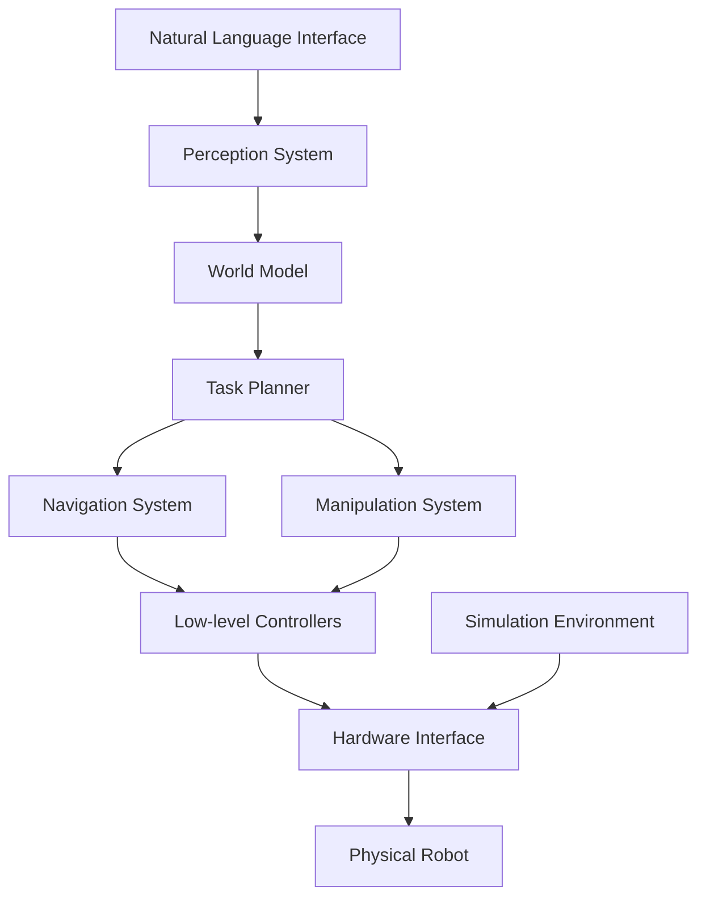

# Capstone Project Specification

## Introduction

The capstone project represents the culmination of the Physical AI & Humanoid Robotics curriculum, integrating all concepts learned across the previous modules. Students will design, implement, and deploy a complete humanoid robotics system that demonstrates proficiency in ROS 2, simulation environments, Isaac AI integration, and Vision-Language-Action (VLA) capabilities. This chapter provides a comprehensive specification for the capstone project, outlining requirements, deliverables, and evaluation criteria.

## Project Overview

### Project Objective

The primary objective of the capstone project is to develop an autonomous humanoid robot capable of understanding natural language commands, perceiving its environment, and executing complex manipulation and navigation tasks. The robot should demonstrate integration of multiple AI and robotics technologies in a cohesive system.

### Key Capabilities Required

1. **Natural Language Understanding**: Interpret and respond to spoken/written commands
2. **Perception**: Recognize objects, people, and environments using vision systems
3. **Navigation**: Plan and execute safe paths in dynamic environments
4. **Manipulation**: Grasp and manipulate objects with dexterity
5. **Human Interaction**: Engage in meaningful interactions with humans
6. **Learning**: Adapt behavior based on experience and feedback

### Target Scenarios

The system should be capable of handling scenarios such as:
- "Robot, please bring me a cup of water from the kitchen"
- "Navigate to the conference room and wait for further instructions"
- "Help me organize these books on the shelf"
- "Monitor the entrance and alert me if anyone arrives"

## Technical Requirements

### System Architecture

The capstone system must follow a modular architecture with the following components:



### Core Components Specification

#### 1. Natural Language Processing Module

**Requirements:**
- Support for speech-to-text conversion
- Natural language understanding for robotic commands
- Intent classification and entity extraction
- Context awareness and dialogue management

**Implementation:**
```python
class NaturalLanguageProcessor:
    def __init__(self):
        self.speech_recognizer = SpeechRecognizer()
        self.language_model = LanguageModel()
        self.intent_classifier = IntentClassifier()
        self.context_manager = ContextManager()

    def process_command(self, audio_input):
        # Convert speech to text
        text = self.speech_recognizer.transcribe(audio_input)

        # Extract intent and entities
        intent, entities = self.language_model.parse(text)

        # Update context
        self.context_manager.update_context(text, intent, entities)

        return {
            'intent': intent,
            'entities': entities,
            'context': self.context_manager.get_context()
        }
```

#### 2. Perception System

**Requirements:**
- Real-time object detection and recognition
- 3D scene understanding
- Person detection and tracking
- Semantic segmentation
- Depth estimation

**Implementation:**
```python
class PerceptionSystem:
    def __init__(self):
        self.object_detector = ObjectDetector()
        self.pose_estimator = PoseEstimator()
        self.segmentation_model = SegmentationModel()
        self.depth_estimator = DepthEstimator()

    def perceive_environment(self, rgb_image, depth_image):
        # Detect objects
        objects = self.object_detector.detect(rgb_image)

        # Estimate poses
        poses = self.pose_estimator.estimate(objects)

        # Segment scene
        semantic_map = self.segmentation_model.segment(rgb_image)

        # Process depth
        depth_map = self.depth_estimator.process(depth_image)

        return {
            'objects': objects,
            'poses': poses,
            'semantic_map': semantic_map,
            'depth_map': depth_map
        }
```

#### 3. World Modeling

**Requirements:**
- Dynamic environment representation
- Object tracking and state management
- Spatial reasoning capabilities
- Map management and updates

**Implementation:**
```python
class WorldModel:
    def __init__(self):
        self.static_map = StaticMap()
        self.dynamic_objects = DynamicObjectTracker()
        self.spatial_reasoner = SpatialReasoner()

    def update_world_state(self, perception_data, robot_pose):
        # Update static map if needed
        self.static_map.update(perception_data['semantic_map'])

        # Update dynamic objects
        self.dynamic_objects.update(
            perception_data['objects'],
            perception_data['poses']
        )

        # Perform spatial reasoning
        spatial_relations = self.spatial_reasoner.analyze(
            perception_data['objects'],
            robot_pose
        )

        return {
            'static_map': self.static_map.get(),
            'dynamic_objects': self.dynamic_objects.get(),
            'spatial_relations': spatial_relations
        }
```

#### 4. Task Planning System

**Requirements:**
- High-level task decomposition
- Action planning with constraints
- Failure recovery mechanisms
- Multi-step planning with subgoals

**Implementation:**
```python
class TaskPlanner:
    def __init__(self):
        self.task_decomposer = TaskDecomposer()
        self.action_planner = ActionPlanner()
        self.failure_handler = FailureHandler()

    def plan_task(self, high_level_goal, world_state):
        # Decompose high-level goal
        subtasks = self.task_decomposer.decompose(high_level_goal)

        # Plan actions for each subtask
        action_sequence = []
        for subtask in subtasks:
            actions = self.action_planner.plan(
                subtask,
                world_state,
                current_plan=action_sequence
            )
            action_sequence.extend(actions)

        return {
            'subtasks': subtasks,
            'action_sequence': action_sequence,
            'constraints': self.extract_constraints(action_sequence)
        }
```

#### 5. Navigation System

**Requirements:**
- Global path planning
- Local obstacle avoidance
- Dynamic replanning
- Safe navigation in human-populated environments

**Implementation:**
```python
class NavigationSystem:
    def __init__(self):
        self.global_planner = GlobalPlanner()
        self.local_planner = LocalPlanner()
        self.obstacle_detector = ObstacleDetector()
        self.safety_controller = SafetyController()

    def navigate(self, start_pose, goal_pose, world_map):
        # Plan global path
        global_path = self.global_planner.plan(start_pose, goal_pose, world_map)

        # Execute with local planning and obstacle avoidance
        current_pose = start_pose
        path_executed = []

        for waypoint in global_path:
            # Local planning to waypoint
            local_path = self.local_planner.plan(
                current_pose,
                waypoint,
                world_map
            )

            # Execute local path with safety checks
            for local_waypoint in local_path:
                if self.safety_controller.is_safe(local_waypoint):
                    # Move to waypoint
                    self.execute_move(local_waypoint)
                    current_pose = local_waypoint
                    path_executed.append(local_waypoint)
                else:
                    # Handle obstacle
                    recovery_action = self.obstacle_detector.handle_obstacle(
                        current_pose, local_waypoint
                    )
                    self.execute_move(recovery_action)

        return path_executed
```

#### 6. Manipulation System

**Requirements:**
- Grasp planning and execution
- Dexterous manipulation
- Tool use capabilities
- Force control for safe interaction

**Implementation:**
```python
class ManipulationSystem:
    def __init__(self):
        self.grasp_planner = GraspPlanner()
        self.trajectory_generator = TrajectoryGenerator()
        self.force_controller = ForceController()
        self.ik_solver = InverseKinematicsSolver()

    def manipulate_object(self, object_info, manipulation_goal):
        # Plan grasp
        grasp_pose = self.grasp_planner.plan_grasp(object_info)

        # Generate approach trajectory
        approach_trajectory = self.trajectory_generator.generate_approach(
            current_pose=self.get_current_pose(),
            target_pose=grasp_pose
        )

        # Execute approach
        self.execute_trajectory(approach_trajectory)

        # Execute grasp with force control
        self.execute_grasp(grasp_pose, force_limit=50.0)

        # Generate manipulation trajectory
        manipulation_trajectory = self.trajectory_generator.generate_manipulation(
            current_pose=grasp_pose,
            goal=manipulation_goal
        )

        # Execute manipulation
        self.execute_trajectory(manipulation_trajectory)

        # Release object if needed
        if manipulation_goal.requires_release:
            self.execute_release()
```

### Integration Requirements

#### ROS 2 Integration
- All modules must be implemented as ROS 2 nodes
- Proper use of topics, services, and actions
- Quality of Service (QoS) configuration for real-time performance
- Parameter management for configuration

#### Simulation Integration
- Full functionality in Gazebo simulation
- Isaac Sim support for advanced physics and rendering
- Simulation-to-real transfer capabilities

#### Hardware Integration
- Support for humanoid robot platforms (e.g., NAO, Pepper, custom platforms)
- Sensor integration (cameras, IMU, force sensors, etc.)
- Actuator control interfaces

## Development Phases

### Phase 1: System Design and Architecture (Weeks 1-2)

**Deliverables:**
- System architecture document
- Component interface specifications
- Technology stack selection
- Development environment setup

**Tasks:**
1. Define system architecture and component interfaces
2. Set up development environment with ROS 2, simulation tools
3. Create initial project structure and build system
4. Design data flow between components

### Phase 2: Core Component Development (Weeks 3-6)

**Deliverables:**
- Individual component implementations
- Unit tests for each component
- Component integration tests
- Performance benchmarks

**Tasks:**
1. Implement perception system
2. Develop world modeling capabilities
3. Create task planning framework
4. Build navigation and manipulation systems
5. Integrate natural language processing

### Phase 3: System Integration (Weeks 7-9)

**Deliverables:**
- Integrated system in simulation
- End-to-end functionality demonstration
- Integration test results
- Performance optimization report

**Tasks:**
1. Integrate all components into unified system
2. Implement system-level coordination
3. Optimize performance and resource usage
4. Conduct comprehensive testing

### Phase 4: Deployment and Validation (Weeks 10-12)

**Deliverables:**
- Deployed system on physical robot (if available)
- Validation results and performance analysis
- User documentation
- Final project report

**Tasks:**
1. Deploy system on target hardware
2. Conduct real-world validation tests
3. Document lessons learned and improvements
4. Prepare final demonstration

## Evaluation Criteria

### Technical Evaluation (60%)

#### System Functionality (20%)
- Successful completion of core capabilities
- Robustness to environmental variations
- Real-time performance requirements

#### Integration Quality (20%)
- Seamless interaction between components
- Proper error handling and recovery
- Efficient resource utilization

#### Innovation (20%)
- Novel approaches or improvements
- Creative problem-solving
- Advanced feature implementation

### Documentation and Presentation (25%)

#### Technical Documentation (10%)
- Clear code documentation
- Architecture diagrams
- User manuals

#### Project Report (10%)
- Comprehensive project overview
- Technical challenges and solutions
- Results analysis and conclusions

#### Presentation (5%)
- Clear communication of project goals and results
- Demonstration of system capabilities
- Response to questions

### Process and Collaboration (15%)

#### Development Process (5%)
- Version control practices
- Code quality and standards
- Testing and validation procedures

#### Project Management (5%)
- Timeline adherence
- Milestone achievement
- Risk management

#### Team Collaboration (5%)
- Effective communication
- Role distribution and coordination
- Conflict resolution

## Technical Standards and Best Practices

### Code Quality Standards

#### ROS 2 Best Practices
- Follow ROS 2 style guide and conventions
- Use appropriate QoS settings
- Implement proper error handling
- Include comprehensive logging

#### Software Engineering Practices
- Modular, reusable code design
- Comprehensive unit and integration testing
- Proper documentation and comments
- Code review processes

### Performance Requirements

#### Real-time Constraints
- Perception pipeline: < 100ms per frame
- Planning decisions: < 500ms for complex tasks
- Navigation updates: > 10Hz
- Manipulation control: > 100Hz

#### Resource Usage
- CPU usage: < 80% average
- Memory usage: < 4GB for core system
- Network bandwidth: < 10MB/s for typical operations

### Safety and Reliability

#### Safety Measures
- Emergency stop functionality
- Collision avoidance systems
- Force limiting for manipulation
- Safe operation boundaries

#### Reliability Features
- Graceful degradation when components fail
- Redundant systems for critical functions
- Comprehensive error reporting
- Automatic recovery mechanisms

## Risk Management

### Technical Risks

#### Hardware Limitations
- **Risk**: Robot hardware may not support all planned features
- **Mitigation**: Develop in simulation first, have backup hardware options

#### Integration Complexity
- **Risk**: Components may not integrate smoothly
- **Mitigation**: Plan integration from the beginning, use well-defined interfaces

#### Performance Issues
- **Risk**: System may not meet real-time requirements
- **Mitigation**: Regular performance testing, optimization from early stages

### Schedule Risks

#### Development Delays
- **Risk**: Individual components take longer than expected
- **Mitigation**: Parallel development where possible, regular progress reviews

#### Testing Challenges
- **Risk**: Difficult to test all scenarios
- **Mitigation**: Comprehensive simulation testing, iterative validation

## Deliverables Checklist

### Software Deliverables
- [ ] Complete source code with documentation
- [ ] ROS 2 package structure
- [ ] Simulation environments and models
- [ ] Configuration files and parameters
- [ ] Unit and integration tests
- [ ] Build and deployment scripts

### Documentation Deliverables
- [ ] System architecture document
- [ ] Component design specifications
- [ ] User manual and API documentation
- [ ] Installation and setup guide
- [ ] Project report
- [ ] Presentation materials

### Demonstration Deliverables
- [ ] Simulation demonstration
- [ ] Real-world demonstration (if hardware available)
- [ ] Video documentation of capabilities
- [ ] Performance benchmark results
- [ ] Validation test results

## Success Metrics

### Quantitative Metrics
- Task completion rate: > 80% for specified scenarios
- Response time: < 2 seconds for simple commands
- Navigation success rate: > 90% in known environments
- Object manipulation success rate: > 75% for common objects

### Qualitative Metrics
- Natural interaction quality
- System robustness in varied conditions
- User satisfaction with interaction
- Adaptability to new scenarios

## Conclusion

The capstone project provides an opportunity to demonstrate mastery of Physical AI and humanoid robotics concepts. Success requires careful planning, systematic development, and thorough testing. The project should showcase the integration of multiple complex systems into a cohesive, functional robot that can interact naturally with humans and operate autonomously in real-world environments.

By following the specifications outlined in this chapter, students will develop a comprehensive understanding of the challenges and solutions involved in creating advanced humanoid robotic systems, preparing them for careers in robotics research and development.

## Further Reading

- "Robotics, Vision and Control" by Peter Corke
- "Probabilistic Robotics" by Sebastian Thrun, Wolfram Burgard, and Dieter Fox
- "Introduction to Autonomous Mobile Robots" by Roland Siegwart, Illah Nourbakhsh, and Davide Scaramuzza
- "Learning to Act: Predictive Learning Models for Multi-Agent Systems" by Peter Stone
